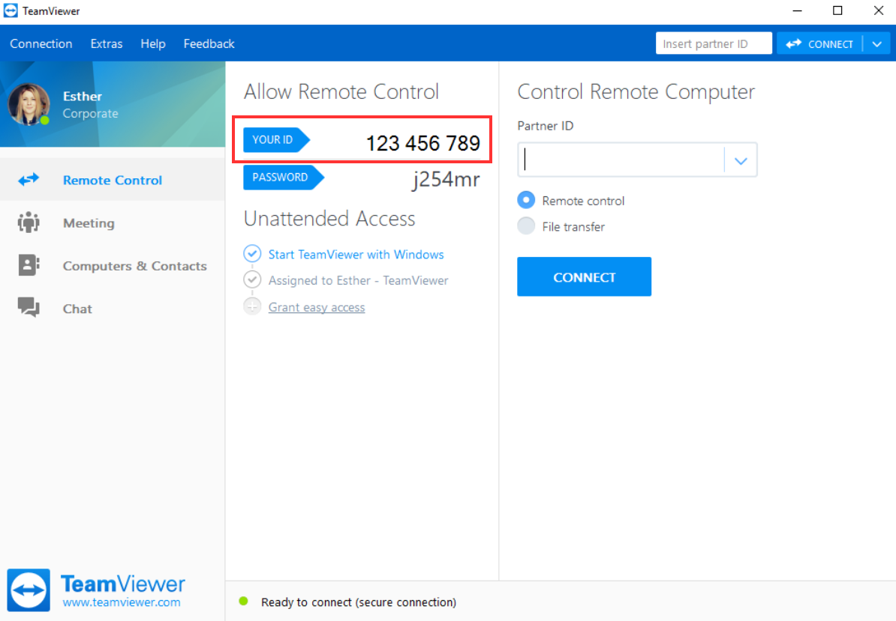

<p>
  
</p>

# El lenguaje de programación Python

<p>
  
</p>

Holas a todos y bienvenidos sean al curso de programación con Python 2020-2. De parte de todos los colaboradores les agradecemos su preferencia y esperamos que el curso le sea útil en su vida profesional. ❤️


### 📅 Fechas y horarios

|    **Nivel**    |            Fecha y hora                |
|:---------------:|:--------------------------------------:|
|   **Básico**    | 10 al 14 de Agosto de 2:30 pm a 4:30 pm|
|  **Intermedio** | 17 al 21 de Agosto de 2:30 pm a 4:30 pm|
|   **Avanzado**  | 24 al 28 de Agosto de 2:30 pm a 4:30 pm|


### 💡 Temario
#### Básico - Semana 1

- Historia
- Sincron


#### Intermedio - Semana 2

- Archivos

#### Avanzado - Semana 3

- Pandas

### ✅ Criterio de evaluación 

|  Criterio   | Porcentaje |
|:----------: |:----------:|
|   Examen    |            |
|  Proyecto   |            |
|   Reporte   |            |


## 📚Calificaciones


|  Nombre   | Examen|  Proyecto  | Reporte |Calificación|Final|
|:----------: |:----------:|:-------: |:-------:|:-------:|:-------:|
|| 0 | 0 | 0 | 0 | 0
|| 0 | 0 | 0 | 0 | 0
|| 0 | 0 | 0 | 0 | 0
|| 0 | 0 | 0 | 0 | 0
|| 0 | 0 | 0 | 0 | 0
|| 0 | 0 | 0 | 0 | 0
|| 0 | 0 | 0 | 0 | 0
|| 0 | 0 | 0 | 0 | 0
|| 0 | 0 | 0 | 0 | 0
|| 0 | 0 | 0 | 0 | 0

### Fechas límites de entrega 

```
Básico: 2020.08.25 11:59 pm
Intermedio: 2020.08.28 11:59 pm
Avanzado: 2020.08.31 11:59 pm
```
### 🖥 Proceso de respuesta de preguntas durante la clase

Le pedimos por favor cuidar su micrófono además de mandar de preferencia dudas como "Me quedé o no me corre el programa a preguntas escritas". Si aún con las sugerencias de los becarios no logra solucionar su problema, le recomendamos instalar 

#### TEAM VIEWER 
[Link de Descarga TeamViewer](https://www.teamviewer.com/en-us/download/)



Para poder controlar su computadora a distancia. Favor de instalarlo antes de los días de clase.

### Contacto

**Samuel Arturo Garrido Sánchez:** samuelgarrido.proteco@gmail.com