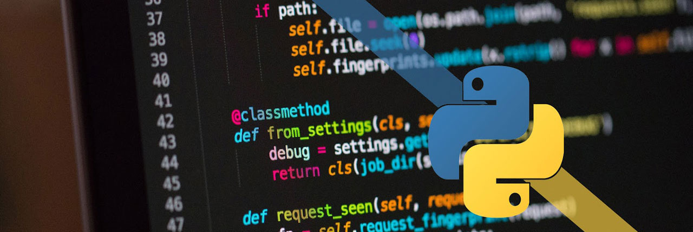
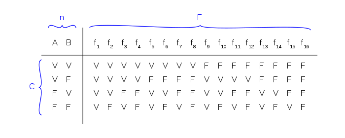

# El lenguaje de programación Python - Básico 🐠

 **<div style="text-align: right"> Samuel Arturo Garrido Sánchez</div>**


```python
print("Hola a mundo!")  #Es costumbre entre los programadores
#(Postdata, esto es un comentario), con # se escriben
```

    Hola a mundo!


Python es un lenguaje de programación **multiparadigma**, muy útil para demasiadas ramas de la investigación, desarrollos y procesos. 
Su filosofía radica en un código legible que cualquier persona no enfocada en el área de programación, pueda comprender.


# ¿Qué es Python?

Python es un lenguaje de programación interpretado cuya filosofía hace hincapié en la legibilidad de su código.

Se trata de un lenguaje de programación multiparadigma, ya que soporta orientación a objetos, programación imperativa y, en menor medida, programación funcional. Es un lenguaje interpretado, dinámico y multiplataforma.

Es administrado por la Python Software Foundation. Posee una licencia de código abierto, denominada Python Software Foundation License, que es compatible con la Licencia pública general de GNU a partir de la versión 2.1.1, e incompatible en ciertas versiones anteriores.



### Las ventajas de Python pueden ser muchas pero en las que destacan:

- La cantidad de bibliotecas que contiene, tipos de datos y funciones incorporadas en el propio lenguaje, que ayudan a realizar muchas tareas habituales sin necesidad de tener que programarlas desde cero.

- La sencillez y velocidad con la que se crean los programas. Un programa en Python puede tener de 3 a 5 líneas de código menos que su equivalente en Java o C.

- La cantidad de plataformas en las que podemos desarrollar, como Unix, Windows, OS/2, Mac, Amiga y otros.

- Además, Python es gratuito, incluso para propósitos empresariales.

### Filosofía Python

La filosofía que rigen las personas que de sean programar en Pythonn están escritas en The Zen of Python (PEP 20), que incluye:

- Hermoso es mejor que feo
- Explícito es mejor que implícito
- Simple es mejor que complejo
- Elaborado es mejor que complicado
- La legibilidad cuenta.

## Y a todo esto, ¿cómo se instala?

### Windows

https://www.python.org/downloads/windows/. 

Click en el enlace "Latest Python 3 Release -Python x.x.x". Si tu ordenador ejecuta la versión de 64 bits de Windows, descarga Windows x86-64 executable installer. De lo contrario, descarga Windows x86 executable installer. Después de descargar el instalador, deberías ejecutarlo (dándole doble click) y seguir las instrucciones.

Una cosa para tener en cuenta: Durante la instalación, verás una ventana de "Setup". Asegúrate de marcar las casillas "Add Python 3.6 to PATH" o "Add Python to your environment variables" y hacer click en "Install Now", como se muestra aquí (puede que se vea un poco diferente si estás instalando una versión diferente)


### Mac

Si has utilizado GNU/Linux alguna vez habrás escuchado la palabra sistema de gestor de paquetes. En macOS se cuenta con ello también, para poder instalar componentes extras a nuestro ordenador.


En escencia para instalar **Python, PHP nativo, MySQL**, y entre más cosas como kits para desarrollar entre otras podrán ser descargadas solo con el comando:


```console
MacBook-Pro-de-Sam:~$ brew install <Lo que quieras instalar>
```

Para poder instalar homebrew necesitarás colocar ésto en tu terminal. Lo usaremos mucho en éste curso y lo usarás mucho si serás desarrollador en general.

```console
MacBook-Pro-de-Sam:~$ /usr/bin/ruby -e "$(curl -fsSL https://raw.githubusercontent.com/Homebrew/install/master/install)"
```

En nuestro caso, una vez instalado Homebrew en nuestra Mac, en la terminal insertaremos: brew install python.
Y se instalará automáticamente.

### Linux


Para los Pro, dependiendo la distribución de linux que tengan, **Fedora, Ubuntu, OpenSUSE**.

En la terminal colocan el comando:

#### Debians (Ubuntu, Mint, etc.) 
```console
:~$ sudo apt-get install python3
```

#### Fedora
```console
:~$ sudo dnf install python3
```

#### OpenSUSE
```console
:~$ sudo zypper install python3
```

## ¿Y quién desarrolló todo esto? ❤️

<p>
  
</p>

Python fue creado a finales de los ochenta3 por **Guido van Rossum** en el Centro para las Matemáticas y la Informática (CWI, Centrum Wiskunde & Informatica), en los Países Bajos, como un sucesor del lenguaje de programación ABC, capaz de manejar excepciones e interactuar con el sistema operativo Amoeba.

**El nombre del lenguaje proviene de la afición de su creador por los humoristas británicos Monty Python.**

Van Rossum es el principal autor de Python, y su continuo rol central en decidir la dirección de Python es reconocido, refiriéndose a él como Benevolente Dictador Vitalicio (en inglés: Benevolent Dictator for Life, BDFL)

## Ejemplos de uso de Python

### Álgebra: Solución a un sistema de ecuaciones

Podemos usar Python para encontrar la solución a un sistema de ecuaciones.

Tenemos el siguiente sistema de ecuaciones:

$$ 2x + y - 3z = 7 $$
$$ 5x - 4y + z = -19  $$
$$ x - y - 4z = 4 $$

Buscaremos la solución del sistema a través de python con uso de matrices.


```python
import numpy as np                            #Importar una biblioteca
A = np.matrix([[2,1,-3],[5,-4,1],[1,-1,-4]])  #Matriz A
B = np.matrix([[7],[-19],[4]])                #Matriz B
X = A**(-1)*B                                 #Inversa de matriz A por B
print("El resultado es: \n",X)                #Impresión de la solución
```

    El resultado es: 
     [[-1.]
     [ 3.]
     [-2.]]


### Crear ventanas: Interfaz gráfica

Podemos importar Tkinter que nos permite la creación de entornos gráficos tales como botones, ventanas, textfields, etc, aunque tendremos que definir desde lo que contendrán éstos elementos hasta su posición x, y.


```python
from tkinter import *
from tkinter import ttk

def calculate(*args):
    try:
        value = float(feet.get())
        meters.set(int(0.3048 * value * 10000.0 + 0.5)/10000.0)
    except ValueError:
        pass

root = Tk()
root.title("Pies a Metros")

mainframe = ttk.Frame(root, padding="3 3 12 12")
mainframe.grid(column=0, row=0, sticky=(N, W, E, S))
root.columnconfigure(0, weight=1)
root.rowconfigure(0, weight=1)

feet = StringVar()
meters = StringVar()

feet_entry = ttk.Entry(mainframe, width=7, textvariable=feet)
feet_entry.grid(column=2, row=1, sticky=(W, E))

ttk.Label(mainframe, textvariable=meters).grid(column=2, row=2, sticky=(W, E))
ttk.Button(mainframe, text="Calcula", command=calculate).grid(column=3, row=3, sticky=W)

ttk.Label(mainframe, text="Pies").grid(column=3, row=1, sticky=W)
ttk.Label(mainframe, text="es equivalente a").grid(column=1, row=2, sticky=E)
ttk.Label(mainframe, text="metros").grid(column=3, row=2, sticky=W)

for child in mainframe.winfo_children(): child.grid_configure(padx=5, pady=5)

feet_entry.focus()
root.bind('<Return>', calculate)

root.mainloop()
```

### Buscador de palabras: Expresiones regulares

Dentro del mundo del big data y minería de datos, la búsqueda de elementos dentro de grandes archivos es escencial. RE se encarga de esto.


```python
import re
texto = "En esta cadena existe una palabra magica"
print(re.search("magica",texto))
print(re.search("hola",texto))


# Match en palabras dentro de Strings
```

    <_sre.SRE_Match object; span=(34, 40), match='magica'>
    None


### Gráficas

Para el área de ciencias e ingenierías, los grafos son instrumentos escenciales para poder dar una interpretación de imagen a un fenómeno, de esta manera, la mente humana pueda analizar mejor dicha información.


```python
from matplotlib import pyplot

## Para que nos muestre la gráfica en Jupyter debemos agregar:
%matplotlib inline

def f(x):
    y = x**2
    return y

x = range(-10,11)
pyplot.plot(x, [f(i) for i in x])
print("Gráfica de f(x) = x^2")
pyplot.show()
```

    Gráfica de f(x) = x^2


## Python es usado para muchísimas otras cosas como: 

* Creación de modelos predictivos (Machine Learning).
* Creación de Sockets (comunicación entre computadores).
* Creación del backend de páginas web con Django.
* Inteligencia Artificial
* Realizar simulaciones de fenómenos físicos
* Scripts que ayudan al funcionamiento de muchos programas que usamos (Mac OS tiene Python 2.7 de fábrica, Linux tiene versiones 3.* en todos sus sabores (distros))
* **Y mucho, muuuuchooo más**


# <center> 🖥   ¿Qué esperamos?   🖍 </center>

## Tipos de "datos" - (objetos)

En Python, todas las **variables son objetos**. Todas las cosas que "declaremos", que reside en algún lugar de la memoria, posee un identificador único que lo diferencia del resto. Piensa en él como si fuera su INE. Para conocer ese identificador, Python dispone de la función id().


```python
numero = 6.989796967
id(numero)
print(id(numero))
```

    5064301184


**Al contrario de otros lenguajes de programación como Java, no es necesario declarar el tipo de variable que se crea.**

Los tipos de datos primitivos no existen como tal en Python, sin embargo podemos saber el tipo de dato que contiene una variable con el método type(dato)


```python
# Los enteros
opcion = 5 
print(opcion)
type(opcion)
```

    5


    int


Una cadena o String es un tipo de dato que guarda una oración o conjunto de letras, símbolos y números para tratarlo como uno solo. En C en cambio un "String" en realidad es un arreglo de caracteres.


```python
saludo = str("Hola")
print(saludo)
saludo1 = "Las saladitas son horneadas"
print(saludo1)
```

    Hola
    Las saladitas son horneadas


```python
#Floats
# ESto es un comentario


enunciado = "Un automóvil se movió 1135.67 metros en 140.86 segundos. Calcule su velocidad"

distancia = 1135.67
tiempo = 140.86 

velocidad = distancia/(tiempo**2)

print(enunciado)
print("\n \t La velocidad del automóvil fue:",velocidad,"m/s")
```

    Un automóvil se movió 1135.67 metros en 140.86 segundos. Calcule su velocidad
    
     	 La velocidad del automóvil fue: 0.05723698981504439 m/s


### Operadores y comparadores matemáticos

Dentro de la programación existe mucha lógica. Varios elementos de comparación en matemáticas como lo es <, >, ≤, ≥, ≠(!=), o algún método dentro de los objetos tienen la función de devolver un elemento **BOOLEANO** (BOOLEANO: TRUE OR FALSE). Nos devuelve este booleano para determinar si es cierto o falso el enunciado.

Además de los clásicos operadores matemáticos descritos por los siguientes símbolos:

- \+ : Suma
- \- : Resta
- \* : Producto
- / : División
- // : División entera 
- % : Módulo o residuo 


```python
a = 6
b = 5
c = 5
print("La suma a+b es: "+str(a)+" + "+str(b)+" = ",a+b)
print("La resta a-b es: "+str(a)+" - "+str(b)+" = ",a-b)
print("El producto a*b es: "+str(a)+" * "+str(b)+" = ",a*b)
print("El cociente a/b es: "+str(a)+"/"+str(b)+" = ",a/b)
print("El cociente entero a/b es: "+str(a)+"//"+str(b)+" = ",a//b)
print("El módulo o residuo a%b es: "+str(a)+"%"+str(b)+" = ",a%b)


## OJO:
## =  1 signo significa asignación, 
## == doble significa preguntar si son iguales a python

print("\n")
print("¿a es igual a b?",a == b) 
print("¿b es igual a c?",b == c)
print("¿a es menor que 5?",a<5)
print("¿b es mayor a c?",b>c)
print("¿c es diferente de 6?",c!=6)

# No solamente se pueden comparar números, también cadenas de texto

texto1 = "Hola"
texto2 = "Hola"
print("¿texto1 es igual a texto2?",texto1 == texto2)
## Tener cuidado al comparar strings de esta manera, se recomienda 
## funciones especializadas.
```

    La suma a+b es: 6 + 5 =  11
    La resta a-b es: 6 - 5 =  1
    El producto a*b es: 6 * 5 =  30
    El cociente a/b es: 6/5 =  1.2
    El cociente entero a/b es: 6//5 =  1
    El módulo o residuo a%b es: 6%5 =  1
    
    
    ¿a es igual a b? False
    ¿b es igual a c? True
    ¿a es menor que 5? False
    ¿b es mayor a c? False
    ¿c es diferente de 6? True
    ¿texto1 es igual a texto2? True


#### ¿Qué sucede aquí?


```python
par = 11%2
par == 0
## La primera línea le asigna el valor 1 a par, la segunda lo compara con 0
```


    False


#### Ejercicio: Quitar la variable de "puedoSalirAlCine" pero obtener el mismo resultado


```python
puedoSalirAlCine = bool() # ¿Por qué no viene al caso hacer ésto?
tareas = 9 # Un control de flujo if/else -> próxima clase
if tareas < 8:
    if puedoSalirAlCine:
        print("Yeih! 😁")
    else:
        print("No yeih ☹️")
        puedoSalirAlCine = False
else:
    print("Me voy 😎")
    puedoSalirAlCine = True
```

    Me voy 😎


#### ¿Y cómo ingreso elementos a la ejecución (a manera de Scanner)?

Si queremos realizar la selección por casos, en Python no contamos con un Switch case pero podemos usar `elif`


```python
numeroInsertado = int(input("Ingrese un número: ")) # ¿Por qué el int al principio? Pista: String
if numeroInsertado  < 5:
    print("😀")
elif numeroInsertado < 10: #O elif?
    print("⭐️")
    
elif numeroInsertado < 30:
    print("🍀")
else:
    print("Es más grande que 30")
```

    Ingrese un número: 20
    🍀


### PALABRAS RESERVADAS: (IMPORTANTE) ⚠️ ‼️

Las palabras reservadas son un conjunto de palabras que **NO** podremos usar como nombre de nuestas variables ya que python sabe que tiene que realizar ciertas acciones si se encuentra con alguna de éstas palabras. Entre las cuales podemos encontrar:

- and
- if
- del
- else
- for
- elif
- is
- from
- raise
- lambda
- assert
- return
- break
- global
- not
- try
- class
- except
- or
- while
- continue
- exec
- import
- yield
- def
- finally
- print

**No vayan a intentar usar alguna de éstas palabras como nombre de sus variables o no funcionará su programa**

## Operadores lógicos. 🐝

Los operadores lógicos son los que trabajan con valores booleanos, nos devuelven falso o verdadero y son la escencia de las condiciones. 

### Operador AND

El operador and evalúa si las condiciones TODAS se cumplen:


```python
True and False
```


    False


Podemos combinar varios operadores AND dentro de la sentenia if, pero tener en cuenta que todas las condiciones deberán ser ciertas para ejecutar el bloque de código que contiene el condidicional o mandarlo para el bloque else.


```python
examenes = int(input("Ingrese el número de exámenes: "))
tareas = int(input("Ingrese el número de tareas: "))
participaciones = int(input("Ingrese el número de participaciones: "))

if examenes >= 10 and tareas >=10 and participaciones >=10:
    print("Podrás ir a la peda")
else:
    print("Híjole creo que no se va a poder")
```

    Ingrese el número de exámenes: 10
    Ingrese el número de tareas: 20
    Ingrese el número de participaciones: 40
    Podrás ir a la peda


### Operador OR

El operador **or** evalúa si **ALGUNO** DE LOS VALORES ES VERDADERO


```python
tengoPaseFiesta = False
miCompaTiene = True

if tengoPaseFiesta or miCompaTiene:
    print("Podemos pasar")
else:
    print("Nos quedamos fuera")
```

    Podemos pasar


```python
edad = 18
dinero = 10000
fama = 80 #supongamos que se mide del 1 al 100

if edad >= 18 or dinero >= 1000 or fama >= 50:
    print("Ya llegué paps")
else:
    print("No te preocupes príncipe, ahí para la otra")
```

    Ya llegué paps


### Operador NOT

El operador **not** devuelve el valor opuesto al valor booleano.


```python
print(not True)
```

    False


```python
mayonesa1 = "Hellmans"
mayonesa2 = "Nestlé"

if mayonesa1 is not "McCORMICK":
    print("Un toque del sabor de mayonesa McCORMICK")
    
if mayonesa2 != "McCORMICK":
    print("Un toque del sabor de mayonesa McCORMICK")
```

    Un toque del sabor de mayonesa McCORMICK
    Un toque del sabor de mayonesa McCORMICK


**Aquí aparece una situación.** ⚠️

Es bastante frecuente que se use de sinónimos a **is** y **==** o **is not** con **!=**. 

Aunque suelen funciona de forma similar sus comportamientos no son exactamente iguales. 

**is** devolverá TRUE si las 2 variables apuntan al mismo objecto.

**==** devolverá TRUE si los valores de las variables son iguales.


```python
a = 1000
b = 999
```


```python
print("¿a es b+1?",a is b + 1)
```

    ¿a es b+1? False


```python
print("¿a continene un valor igual a b+1?",a == b + 1)
```

    ¿a continene un valor igual a b+1? True


### ¿Se pueden combinar todo lo visto hasta ahora? Sí


```python
a = 5==5 
b = True
c = 5 is not 7

if not((a or b) and c):
    print("Ya les dio calambre cerebral?")
else:
    print("Todavía")
```

    Todavía


#### Para mayor información de cómo tratar con los booleanos existe algo llamado álgebra relacional que tiene mucho que ver con los componentes eléctricos y eléctronicos que usamos todos los días, desde una lavadora hasta grúas. 

Un ejemplo de una tabla de verdad es la siguiente y los posibles resultados que ponemos obtener solo de 2 variables.



## Colecciones 🐆

Una colección permite agrupar varios objetos bajo un mismo nombre. El equivalente a las listas, tuplas y diccionarios en otros lenguajes de programación son ArrayList, SetMaps o Maps, Sets, etc., la ventaja y desventaja si es usado incorrectamente de Python es que cualquier colección de elementos puede contener cualquier elemento ya que todos son objetos en realidad(wrappers).

En Python existen tres colecciones básicas.

- Listas `[ ]`
- Tuplas `( )`
- Diccionarios `{ }`


```python
listaEjemplo = [1,2,3]
tuplaEjemplo = (4,5,6)
diccionarioEjemplo = {7:"Hola",8:"Gracias",9:"Adiós"}

listaMixta = [1,"Hola",True,3.1416,[2,"Polo"]]
tuplaMixta = ("Jaja",False,4<7,("Hola",1,2))
diccionarioMixto = {True:"Hola",2:5.3,1:"Fin"}

mixto = [1,{1:2},3,([4,"5"],6.6,(7<8,9!=10),11,{12:13,14:[15,"16 17","18.8"]},19),20]
```

#### Mutabilidad 🐛🦋

La mutabilidad radica si un elemento dentro de un objeto o el objeto mismo puede cambiar algún atributo que posea. Si es mutable, podemos hacer el cambio, en caso contrario recibiremos un error.

### Listas 🐜

Son colecciones de elementos que permiten la mutabilidad de elementos. Se delimitan por corchetes `[ ]`

Existen una serie de funciones que nos permiten interactuar con una lista. 
Para una función solo agregamos a la lista un punto, seguido de la función y sus parámetros.     

**lista.funcion(parámetro)**

**OJO:** Los índices de las listas comienzan desde el 0, quiere decir que si nos queremos referir al primer elemento de la lista diremos que está en la posición 0.

**Métodos importantes:**

- `append(x):` Agrega un elemento x al final de la lista.
- `insert(i, x):` Agrega un elemento x en la posición i que le indiquemos.
- `remove(x):` remueve 1 elemento x de la lista. 
- `pop( ):` Nos remueve el último de la lista pero igual nos permite saber cuál fue.
- `clear( ):` Remueve todos los elementos de la lista.
- `index(x):` Nos devuelve el índice o posición de la primer coincidencia de un elemento con x.
- `count(x):` Cuenta cuántos elementos x hay en la lista.
- `sort( ):` Ordena la lista de menor a mayor con números o alfabéticamente con Strings.
- `len( ):` Calcula la cantidad de elementos o longitud de la lista.


```python
## Aquí tenemos una lista, se puede diferenciar de los demás porque tiene [ ] corchetes

lista = [4, 8, 16, 43, 23, 300, 44, 76, 65,44,44]

## Removemos solo 1 elemento 44
lista.remove(44)
print("Lista después de remover un 44: ",lista)

## Para acceder a un elemento en determinada posición, 
## colocaremos el nombre de la lista y entre corchetes el índice
## Ejemplo: lista[0] -> Elemento en la lista en la pos. 0 

print("Elemento en la posición 8 de lista: ",lista[8])

lista.append(100)
print("Lista después de agregar 100 al final:",lista)

lista.insert(2,5)
print("Lista después de insertar 5 en la pos. 2: ",lista)

print("Tamaño lista:",len(lista), ", lista: ",lista)

print("El número 23 se encuentra en la posición: ",lista.index(44))

lista.sort()
print("Lista ordenada: ",lista)
```

    Lista después de remover un 44:  [4, 8, 16, 43, 23, 300, 76, 65, 44, 44]
    Elemento en la posición 8 de lista:  44
    Lista después de agregar 100 al final: [4, 8, 16, 43, 23, 300, 76, 65, 44, 44, 100]
    Lista después de insertar 5 en la pos. 2:  [4, 8, 5, 16, 43, 23, 300, 76, 65, 44, 44, 100]
    Tamaño lista: 12 , lista:  [4, 8, 5, 16, 43, 23, 300, 76, 65, 44, 44, 100]
    El número 23 se encuentra en la posición:  9
    Lista ordenada:  [4, 5, 8, 16, 23, 43, 44, 44, 65, 76, 100, 300]


#### Podemos tener listas con elementos mixtas e incluso listas dentro de listas y estos dentro de listas y sucesivamente. No se recomienda hacer tanto anidamiento.


```python
lista2 = ["Hola","Adiós",2,False,4.5,[1,[2,3],4]]
print("Lista:",lista2)
lista2.append(6)
print("Lista después de agregar un 6: ",lista2)
print("Índice de 2 en la lista",lista2.index(2))
```

    Lista: ['Hola', 'Adiós', 2, False, 4.5, [1, [2, 3], 4]]
    Lista después de agregar un 6:  ['Hola', 'Adiós', 2, False, 4.5, [1, [2, 3], 4], 6]
    Índice de 2 en la lista 2


```python
## Algunos métodos como sort no se podrán ya que los elementos que contiene no son del mismo tipo.
lista2.sort()
```


    ---------------------------------------------------------------------------

    TypeError                                 Traceback (most recent call last)

    <ipython-input-34-71fd039ea1e5> in <module>()
          1 ## Algunos métodos como sort no se podrán ya que los elementos que contiene no son del mismo tipo.
    ----> 2 lista2.sort()
    

    TypeError: '<' not supported between instances of 'int' and 'str'


### Tuplas 🐢

Como las listas, las tuplas siguen la misma estructura. Son idénticas a las listas pero con una pequeña excepción: **NO son mutables**.

Si tratamos de cambiar algún elemento por otro o eliminar, nos marcará un error.

**Métodos importantes:**

- `index(x):` Nos devuelve el índice o posición de la primer coincidencia de un elemento con x.
- `count(x):` Cuenta cuántos elementos x hay en la tupla.
- `len( ):` Calcula la cantidad de elementos o longitud de la tupla.


```python
tupla = (16,53,23,76,98,43,43,56,99,77,21,32) #Se usan paréntesis en lugar de corchetes ()


## Para acceder a un elemento en determinada posición, 
## colocaremos el nombre de la tupla y entre corchetes [] el índice
## Ejemplo: tupla[0] -> Elemento en la lista en la pos. 0 

print("Elemento en la posición 1:",tupla[1])

print("Cantidad de 43 en la tupla:",tupla.count(43))

print("Cantidad de elementos o tamaño de la tupla:",len(tupla))
```

    Elemento en la posición 1: 53
    Cantidad de 43 en la tupla: 2
    Cantidad de elementos o tamaño de la tupla: 12


```python
tupla.append(100)
tupla.sort()
```


    ---------------------------------------------------------------------------

    AttributeError                            Traceback (most recent call last)

    <ipython-input-2-59e97cb5c63b> in <module>()
    ----> 1 tupla.append(100)
          2 tupla.sort()


    AttributeError: 'tuple' object has no attribute 'append'


> Los errores generados son gracias a que queríamos modificar una tupla, la cual no tiene el método pop,sort,append,insert o similares, que modifican a la misma. Solo podemos usar métodos que no manipulen su estructura.

**Y a todo ésto... ¿Para qué necesitamos tuplas si tenemos listas?** 

Razone el siguiente ejemplo, ¿qué está pasando?


```python
x = [1,2,3,4,5]
y = x
print(y)
```

    [1, 2, 3, 4, 5]


```python
x[0] = 10
print(y)
```

    [10, 2, 3, 4, 5]


```python
id(x) == id(y)
```


    True


```python
z = (1,2,3,4,5)
y = z
x[1] = 50
print(x)
print(y)
print(z)

p = (1,2)
q = [1,2]

p is q
```

    [10, 50, 3, 4, 5]
    (1, 2, 3, 4, 5)
    (1, 2, 3, 4, 5)


    False


### Diccionarios 🦖

Los diccionarios son lo equivalente a tablas Hash, a cada llave se le asigna un valor. 

De manera sencilla podemos dar un ejemplo: 

Tenemos un buró con muchos cajones, en los cajones podemos guardar cosas que en este caso serán variables y cuando queramos buscar una crema en el buró, naturalmente tendremos qué saber en qué cajón está. Los cajones tienen una referencia (el cajón de abajo por ejemplo) y en el caso de los diccionarios, las llaves son los cajones y guardan variables. 

Los diccionarios se escriben entre`{}` llaves y llevan la estructura `{llave:valor,llave:valor,llave:valor}`

**Métodos importantes:**

- `clear()`: Elimina todos los elementos del diccionario
- `copy()`: Devuelve una copia del diccionario
- `fromkeys(x,y)`: Devuelve un diccionario con las claves y el valor especificados
- `get(x)`: Devuelve el valor de la clave especificada
- `items()`: Devuelve una lista que contiene una tupla para cada par clave-valor
- `keys()`: Devuelve una lista que contiene las claves del diccionario
- `pop(x)`: Elimina el elemento con la clave especificada
- `popitem()`: Elimina el último par clave-valor insertado
- `setdefault()`: Devuelve el valor de la clave especificada. Si la clave no existe: inserte la clave, con el valor especificado
- `update(x,y)`: Actualiza el diccionario con los pares clave-valor especificados
- `values()`: Devuelve una lista de todos los valores del diccionario.


```python
miPrimerDiccionario = {1:"Hola",2:"Adiós"}
print("Valor de llave 1: ",miPrimerDiccionario[1])

print("Las llaves que tiene mi diccionario:",miPrimerDiccionario.keys())
print("Las cosas que tiene que mi diccionario:",miPrimerDiccionario.items())
```

    Valor de llave 1:  Hola
    Las llaves que tiene mi diccionario: dict_keys([1, 2])
    Las cosas que tiene que mi diccionario: dict_items([(1, 'Hola'), (2, 'Adiós')])


```python
miDiccionario = {"Hola":[(1,2),6,7,True],"verde":"kiwi","amarillo":"platano","amarillo":"Adiós"}
```


```python
print(miDiccionario["amarillo"])
print("Para acceder al 2 dentro de miDiccionario: ",miDiccionario["Hola"][0][1])
```

    Adiós
    Para acceder al 2 dentro de miDiccionario:  2


```python
##Podemos definir diferentes tipos de objetos para que sea nuestra clave valor, incluso hacer diccionarios de tuplas de listas
dic = {False:[1,True,2.3,"Hola"],1:"Poco"}

print(dic[False])
```

    [1, True, 2.3, 'Hola']


```python
baseDatos = {
    1: {
        "nombre":"Samuel",
        "apellido":"Garrido",
        "NumCuenta":418045231
    },
    2: {
        "nombre":"Alicia",
        "apellido":"Carballido",
        "NumCuenta":423154132
    },
    3: {
        "nombre":"Alejandro",
        "apellido":"Barreiro",
        "NumCuenta":432131523
    },
    4: {
        "nombre":"Ana",
        "apellido":"Lagunas",
        "NumCuenta":462314263
    }
}

for x in baseDatos:
    print(str(baseDatos[x]['NumCuenta'])+": "+baseDatos[x]['nombre']+" "+baseDatos[x]['apellido'])
```

    418045231: Samuel Garrido
    423154132: Alicia Carballido
    432131523: Alejandro Barreiro
    462314263: Ana Lagunas


Como podemos ver, se hace una colección de elementos para podernos referirnos a éstos más adelante por otro nombre o con una llave.

**Hasta éste momento:**
## <center> [ ] corchetes para listas -> mutable</center>
## <center> ( ) paréntesis para tuplas -> inmutable </center>
## <center> { } llaves para diccionarios -> cajones </center>


```python
profesores = ["Laura","Samuel","Hola"]
if profesores[0] == "Laura":
    print("Laura se encuentra en la posición: ",profesores.index("Laura"))
if len(profesores) == 3:
    print("Hay 3 profesores en el curso")
else:
    profesores.append("Fulano")
    print(profesores)
```

    Laura se encuentra en la posición:  0
    Hay 3 profesores en el curso


```python
arreglo = [1,2,3,4,5]
if arreglo[1]*arreglo[2] == 2:
    print(2)
elif arreglo[3]*arreglo[2] == 12:
    print(12)
elif arreglo[1]*arreglo[3] == 8: # ¿Qué pasaría si reemplazo elif por if?
    print(8)
else:
    print(0)
```

    12


## Ciclos 🌀

Los ciclos nos permiten hacer repeticiones de procesos dentro de un rango que nosotros determinemos. 

Esto es útil para NO hacer cada uno de los pasos si son repetitivos, por lo que haríamos líneas de código innecesarias. (Además, ¡qué flojera!)

### Ciclo for (para cada) ➰

Los ciclos for en python funcionan tienen una estructura algo distinta en Python que por ejemplo C o Java. Para poder utilizarlo tendremos que hacer uso de la palabra reservada **in** y luego a decisión,

La función `range()` nos devuelve un arreglo de números.

Si range(x) le insertamos solo 1 parámetro, **"x"** simboliza el punto de llegada -1 desde 0 de 1 en 1.

Si a range(x,y) le insertamos 2 parámetros, **"x"** simboliza el punto de partida y **"y"** el punto de llegada -1 y va contando de 1 en 1 hasta llegar.

Si a range(x,y,z) le insertamos 3 parámetros, **"x"** simboliza el punto de partida, **"y"** el punto de llegada -1 y z de cuanto en cuánto va salteando.


```python
jaja = [1,4,6,8]
jaja.append(1)
jaja.append(2)
jaja.append(3)
print(jaja)
```

    [1, 4, 6, 8, 1, 2, 3]


```python
listaNormal = []

for numeroInsertar in range(-4,-60,-2):
        listaNormal.append(numeroInsertar)

print(listaNormal)
```

    [-4, -6, -8, -10, -12, -14, -16, -18, -20, -22, -24, -26, -28, -30, -32, -34, -36, -38, -40, -42, -44, -46, -48, -50, -52, -54, -56, -58]


```python
a = range(10)
b = range(-10,10)
c = range(-10,10,2)

print("Primer ciclo")
for i in a:
    print(i)

print("\nSegundo ciclo")
for i in b:
    print(i)

print("\nTercer ciclo")
for i in c:
    print(i)
```

    Primer ciclo
    0
    1
    2
    3
    4
    5
    6
    7
    8
    9
    
    Segundo ciclo
    -10
    -9
    -8
    -7
    -6
    -5
    -4
    -3
    -2
    -1
    0
    1
    2
    3
    4
    5
    6
    7
    8
    9
    
    Tercer ciclo
    -10
    -8
    -6
    -4
    -2
    0
    2
    4
    6
    8


** Los ciclos for pueden implementarse con range() o con una colección (lista, tupla o diccionario) para que sea recorrido. No es necesario colocar contadores adicionales.** 


```python
for i in [1,5,9,2,6,9,0]:
    print(i)
```

    1
    5
    9
    2
    6
    9
    0


```python
jaja2 = [1,4,6,8]
for i in range(0,3,1): # ¿Cómo modifico ésto para que sea más sencillo?
    jaja2.append(i)
print(jaja2)
```

    [1, 4, 6, 8, 0, 1, 2]


```python
## Para recorrer un diccionario el for irá recorriendo las llaves, será nuestro deber colocar
## el nombre del diccionario con la clave para que nos traiga el valor.

frutas = {'Fresa':'Roja','Limón':'Verde','Papaya':'Naranja','Manzana':'amarilla','Guayaba':'rosa'}
for llave in frutas:
    print(llave, 'es de color', frutas[llave])
    
```

    Fresa es de color Roja
    Limón es de color Verde
    Papaya es de color Naranja
    Manzana es de color amarilla
    Guayaba es de color rosa


## Ciclos while ➿

El ciclo while permite ejecutar un bloque de instrucciones mientras se cumpla la condición dada. Primero comprueba que en efecto se cumple la condición dada y entonces, ejecuta el segmento de código correspondiente hasta que la condición no se cumpla.


```python
numero = 0
while numero <= 10:
    print(numero)
    numero += 1
```

    0
    1
    2
    3
    4
    5
    6
    7
    8
    9
    10


### Ejercicio: ¿Qué sucede en estos 2 casos?


```python
nombre = ""

while not nombre:
    nombre = input('Escribe tu nombre: ')
```

    Escribe tu nombre: Samuel


```python
while True:
    entrada = input('Escibe tu nombre: ')
    if not entrada: 
        break
```

    Escibe tu nombre: 


## Controles de bucles 🛑 ⚠️

### Break:  Rompe el ciclo en determinada condición


```python
for number in range(10):
    if number == 5:
        break    # se rompe al contar a 5
    print('El número es: ',number) 
print('Se murió')
```

    El número es:  0
    El número es:  1
    El número es:  2
    El número es:  3
    El número es:  4
    Se murió


```python
ejemplo = 0
## Un ciclo infinito puede darse con while True
while True:   
    if ejemplo == 6:
        break
    print(ejemplo)
    ejemplo += 1
```

    0
    1
    2
    3
    4
    5


### Continue: Omite o anula la ejecución del código debajo de él en caso de una condición pero se va a la siguiente iteración. No rompe el ciclo


```python
for numero in range(10):
    if numero == 5 or numero == 4:
        continue    # No imprime ni el 5 ni el 4
    print(numero)
```

    0
    1
    2
    3
    6
    7
    8
    9


### Pass: Operación nula, o sea que no pasa nada cuando se ejecuta. 

Se utiliza cuando se requiere por sintaxis una declaración pero no se quiere ejecutar ningún comando o código. También se utiliza en lugares donde donde el código irá finalmente, pero no ha sido escrita todavía o se quisiera hacer un debug del programa


```python
for number in range(10):
    if number == 5:
        print("Hola")
        pass
        print("Adiós")
    print('Número: ' + str(number))
```

    Número: 0
    Número: 1
    Número: 2
    Número: 3
    Número: 4
    Hola
    Adiós
    Número: 5
    Número: 6
    Número: 7
    Número: 8
    Número: 9


### Listas por comprensión 🦏

No, no es comprender literalmente las listas o tuplas o lo que sea, significa que podemos ahorrarnos unas líneas de código escribiendo o creando una lista con un for dentro. Veamos un ejemplo:


```python
saludo = "ola ke ace"
print(saludo)
## Primero como paréntesis: el método capitalize pone la primera letra en mayúscula
print(saludo.capitalize())
```

    ola ke ace
    Ola ke ace


```python
## TODA ESTAS LÍNEAS DE CÓDIGO

lenguajes = ["python", "c", "c++", "java","swift","kotlin","c#","shell","php","js"]
lenguajesEnMayusculas = []

for cadaUno in lenguajes:
    lenguajesEnMayusculas.append(cadaUno.capitalize())

print(lenguajesEnMayusculas)
```

    ['Python', 'C', 'C++', 'Java', 'Swift', 'Kotlin', 'C#', 'Shell', 'Php', 'Js']


```python
## PODEMOS REDUCIRLO A ÉSTO

otraVezEnMayusculas = [cadaLenguaje.capitalize() for cadaLenguaje in lenguajes]
print(otraVezEnMayusculas)
```

    ['Python', 'C', 'C++', 'Java', 'Swift', 'Kotlin', 'C#', 'Shell', 'Php', 'Js']


Por ejemplo, quiero una lista con todos los números al cuadrado, podemos hacerlo con una lista de comprensión


```python
numeros = [1, 2, 3, 4, 5]
alcuadrado = [n ** 2 for n in numeros]
print(alcuadrado)
```

    [1, 4, 9, 16, 25]


## Preparados listos: Funciones ⭐️

Una función es un bloque de código con un nombre asociado, que recibe cero o más argumentos como entrada, sigue una secuencia de sentencias, la cuales ejecuta una operación deseada y devuelve un valor y/o realiza una tarea.

La sentencia def es una definición de función usada para crear objetos funciones definidas por el usuario.


```python
 def hola(nombre):   # def: Se utiliza siempre que queramos definir una función
        print("Hola", nombre, "!")
```


```python
hola("Alicia")
```

    Hola Alicia !


### ¿Cómo se le conoce a lo que va entre paréntesis? 
Al definir una función los valores los cuales se reciben se denominan parámetros, pero durante la llamada los valores que se envían se denominan argumentos


```python
def suma(a,b): ## Aquí a y b se le conoce como parámetros
    print(a+b)

suma(5,2) ## aquí a 5 y 2 se le denomina argumentos
```

    7


```python
def f(x,y):
    print(x**2 + 2*x + 1 + y**2)

f(2,4)
```

    25


### Valores de retorno
Qué tal si queremos lo que suceda dentro de la función para otras cosas, no sé digamos que hace una operación matemática y queremos el resultado para otras cuentas. Existe algo que se llama return o valor retorno que quiere decir lo que devuelve la función


```python
def suma(a, b):
    return a + b

print(suma(5,3))
```

    8


```python
## Achis achis y mi suma?

print(suma(5,3))
```

    8


```python
#Vamos a ver un ejemplo matemático x^2

def f(x):
    y = x**2
    return y

operacion = f(5) + 10 # Devolvemos 5**2 + 10
print(operacion) 
```

    35


#### Se puede llamar a los parámetros de una función por posición o por nombre:
#### Y  puede tener parámetros por defecto:


```python
def algo(a,b):
    print("Resta de "+str(a)+" - "+str(b)+" = ",a-b)
    
algo(5,1)
algo(b=5,a=1)
```

    Resta de 5 - 1 =  4
    Resta de 1 - 5 =  -4


```python
## Parámetros por defecto, en caso que no pongas nada se toma el valor indicado al definir
def cosa(a=0,b=5):
    print("Resta de "+str(a)+" - "+str(b)+" = ",a-b)
    
cosa() ## 0 - 5
cosa(b=5,a=1) ## 1 - 5
cosa(10,1) ## 10 - 1
```

    Resta de 0 - 5 =  -5
    Resta de 1 - 5 =  -4
    Resta de 10 - 1 =  9


#### Una función dentro de otra

Es posible tener un def dentro de otro pero para mandar a llamar a una función primero debes mandar a llamar a la que lo contiene. Si mandamos a llamar a la `funcion( )` esta a su vez mandará a llamar a la `funcion2()`


```python
def funcion(p,q):
    r = p + q
    
    def funcion2(s):
        print(s)
        
    funcion2(5)

funcion(8,8)
```

    5


```python
#Función para saber si un número es múltiplo de otro. El primer argumento
## indica la función interna y el otro argumento la función externa

def multiplo(n):
    def multiploDe(num):
        return num%n == 0
    return multiploDe
print("¿Es 9 múltiplo de 3?",(multiplo(9))(3))
```

    ¿Es 9 múltiplo de 3? False


```python
print("¿Es 9 múltiplo de 3?",(multiplo(3))(9))
```

    ¿Es 9 múltiplo de 3? True


```python
##Podemos mandar de lo que sea a los parámetros, hasta listas:

def sumar(numbers):
    result = 0
    for number in numbers:
        result += number
    return result

print("Suma de 4 + 5 = ",sumar([4,5]))
```

    Suma de 4 + 5 =  9


## Ejercicio: Hacer una calculadora 🧮

Con lo aprendido hasta ahora, realizar una calculadora que haga las siguientes operaciones:

- Suma
- Resta
- Multiplicación
- División
- Cuadrado
- Residuo


### Recursividad: Llamada a sí misma de una función 🌦


Recursión o recursividad es la forma en la cual se especifica un proceso basado en su propia definición. ​ La recursión tiene esta característica discernible en términos de autorreferencialidad, autopoiesis, fractalidad, o, en otras palabras, construcción a partir de un mismo tipo.

**Podemos hacer una cuenta regresiva para mandar misiles:**


```python
print("Trump: Hey siri, how many miles did i ran today?")
print("Siri: ok, sending missiles to Iran today!")

def cuenta_regresiva(numero):
    numero -= 1
    if numero > 0:
        print(numero)
        cuenta_regresiva(numero)
    else:
        print(numero)

cuenta_regresiva(5)
print("Boom!")
```

    Trump: Hey siri, how many miles did i ran today?
    Siri: ok, sending missiles to Iran today!
    4
    3
    2
    1
    0
    Boom!


Un clásico ejemplo es realizar el factorial de un número


```python
def factorial(numero):
    if numero > 1:
        numero = numero * factorial(numero -1)
    print(numero)
    return numero
print("El factorial de 9 es: ",factorial(9))
```

    1
    2
    6
    24
    120
    720
    5040
    40320
    362880
    El factorial de 9 es:  362880


## Iteradores y generadores 🍅

Los "iteradores" y "generadores" son objetos que cuentan con el método __next__(), el cual regresa una serie de objetos de uno en uno cada vez que es invocado.


```python
lista = ['1', 2, 'tres', 4.0]
print(lista)
```

    ['1', 2, 'tres', 4.0]


Creamos un iterador para ir pasando los elementos de una lista


```python
iterador = iter(lista)
print(iterador)
```

    <list_iterator object at 0x108093dd8>


```python
next(iterador)
```


    '1'


```python
next(iterador)
```


    2


```python
next(iterador)
```


    'tres'


### Yield 🍊

Básicamente los generadores se escriben funciones normales, pero usan la sentencia yield en vez de un return dentro de un bucle. Yield funciona de manera similar al return, pero la gracia de usar el yield es que conserva la iteración del bucle para la siguiente vez que se le invoque.


```python
def contador(max):
    n=0
    while n < max:
            yield n
            n=n+1

miCuenta = contador(5)
print(miCuenta)
for i in miCuenta: ## Mandamos a traer lo que nos devuelve yield en cada ciclo
    print(i)
```

    <generator object contador at 0x10805bd58>
    0
    1
    2
    3
    4


El resultado es el mismo que si, en lugar de mycont = contador(5) hubiéramos instanciado una lista: mycont = [0,1,2,3,4] o mycont = range(0,5). Pero de hecho lo que ocurre es muy diferente.

Cuando el intérprete Python encuentra una función que incluye un yield (o varios), entiende que al llamar esta función no obtendremos un valor devuelto con un return, sino que obtendremos un generador (generator).

Un generador se comporta parecido a una lista, en el sentido que puede ser recorrida con un iterador - la diferencia es que los valores no están almacenados en una colección, sino que se generan "on the fly".

## Decoradores 🕯

Los decoradores son en sí mismos funciones, que toman como argumento una función y retornan otra función. No es más que una función la cual toma como input una función y a su vez retorna otra función. Puede sonar algo confuso ¿no? lo que nos debe quedar claro es que al momento de implementar un decorador estaremos trabajando, con por lo menos, 3 funciones. El input, el output y la función principal. 


```python
def decorador(pasadaSuma):
    def function(a, b):
        print("Función sumar() llamada!")
        return pasadaSuma(a, b)
    return function

@decorador
def sumar(a, b):
    return a + b

print(sumar(7, 5)) ## Si mando a llamar a sumar, también mandaré a llamar al decorador
```

    Función sumar() llamada!
    12


## Lambdas 🍒

Se trata de crear funciones de manera rápida, just in time, sobre la marcha, para prototipos ligeros que requieren únicamente de una pequeña operación o comprobación.

```python
lambda argumentos: resultado
```


```python
def f(x, y, z):
    return (x+y) * z

print("(5+6) * 4 =",f(5,6,4))
```

    (5+6) * 4 = 44


```python
g = lambda x, y, z: (x+y) * z

print("(5+6) * 4 =",(g(5,6,4)))
```

    (5+6) * 4 = 44


En el ejemplo anterior, un lambda nos permite definir tanto a f y g en una sola línea y ambos tienen el mismo resultado.


```python
def Multiplo(n):
    return lambda a : a * n

productoCon = Multiplo(3)

print("11 * 33 =",productoCon(11)) 

## Podemos incluso devolver una función lambda para pasarle parámetros de otra función en este caso
```

    11 * 33 = 33


# Programación Orientada a Objectos  🐆

La Programación Orientada a Objetos (POO u OOP según sus siglas en inglés) es un paradigma de programación que usa objetos y sus interacciones para diseñar aplicaciones y programas de computadora. Está basado en varias técnicas, incluyendo herencia, modularidad, polimorfismo, y encapsulamiento. Su uso se popularizó a principios de la década de 1990. Actualmente son muchos los lenguajes de programación que soportan la orientación a objetos.

La programación Orientada a objetos (POO) es una forma especial de programar, más cercana a como se expresan las cosas en la vida real que otros tipos de programación.

## Definiciones ⭐️

#### Clase
Definiciones de las propiedades y comportamiento de un tipo de objeto concreto. La instanciación es la lectura de estas definiciones y la creación de un objeto a partir de ellas.

#### Objeto
Instancia de una clase. Entidad provista de un conjunto de propiedades o atributos (datos) y de comportamiento o funcionalidad (métodos), los mismos que consecuentemente reaccionan a eventos. Se corresponden con los objetos reales del mundo que nos rodea, o con objetos internos del sistema (del programa). Es una instancia a una clase.

#### Método
Algoritmo asociado a un objeto (o a una clase de objetos), cuya ejecución se desencadena tras la recepción de un “mensaje”. Desde el punto de vista del comportamiento, es lo que el objeto puede hacer. Un método puede producir un cambio en las propiedades del objeto, o la generación de un “evento” con un nuevo mensaje para otro objeto del sistema.

#### Comportamiento
Está definido por los métodos o mensajes a los que sabe responder dicho objeto, es decir, qué operaciones se pueden realizar con él.

#### Atributos
Características que tiene la clase

#### Componentes de un objeto
Atributos, identidad, relaciones y métodos.

#### Identificación de un objeto
Un objeto se representa por medio de una tabla o entidad que esté compuesta por sus atributos y funciones correspondientes.


```python
class Coche:
    
    def __init__(self, rueditas,puertitas):
        self.ruedas = rueditas
        self.puertas = puertitas
    def desplazarse(self):
        print("El coche se esta desplazando sobre ruedas")

unCoche = Coche(4,5)
print("Mi coche tiene ", unCoche.ruedas ,"ruedas")
```

    Mi coche tiene  4 ruedas


## Pilares de la programación orientada a objetos 🦁

### Abstracción 🌹
permite identificar las características y comportamientos de un objeto y con los cuales se construirá la clase (plantilla).  Esto quiere decir que a través de este pilar o fundamento es posible reconocer los atributos y métodos de un objeto.

### Encapsulamiento 🍄
Es la característica de la POO que permite el ocultamiento de la complejidad del código, pertenece a la parte privada de la clase y que no puede ser vista desde ningún otro programa.

### Herencia 💐
Es el pilar más fuerte que asegura la reutilización de código, ya que a partir de esta característica es posible reutilizar (heredar) las características y comportamientos de una clase superior llamada clase padre, a sus clases hijas, denominadas clases derivadas. Esto implica que una vez desarrollado el código de una clase base, su código puede ser reutilizado por las clases derivadas.

### Polimorfismo 🍀
A través de esta característica es posible definir varios métodos o comportamientos de un objeto bajo un mismo nombre, de forma tal que es posible modificar los parámetros del método, o reescribir su funcionamiento, o incrementar más funcionalidades a un método.


```python
class Persona:
    cedula = "V-13458796"
    nombre = "Leonardo"
    apellido = "Caballero"
    sexo = "M"
    
    def saludar(self):
        print("Hola soy ",self.nombre,", mi cédula es: ",self.cedula," y mi sexo es: ",self.sexo)

#Crear una persona
PersonaCreada = Persona()

#Llamar a un método
PersonaCreada.saludar()

## Lllamar a un atributo
print("Mi Sexo es:",PersonaCreada.sexo)
```

    Hola soy  Leonardo , mi cédula es:  V-13458796  y mi sexo es:  M
    Mi Sexo es: M


## Atributos y métodos 🐘

### Atributos: características con las que cuenta un objeto -> Adjetivos calificativos
### Métodos: cosas que puede hacer el objecto -> verbos

### Atributos de instancia
Atributos de Instancia

Los atributos de instancia son aplicables a un solo objeto. Determinan el estado en el que se encuentra un objeto.

**Ejemplo:**
El atributo altura en la clase Persona es de instancia, debido a que cada persona tendrá su propia altura.

### Atributos de clase

  Un atributo de clase es un atributo común a todos los objetos instanciados de la clase. Al estar definido en la clase no hace falta instanciar la clase para utilizarlo. Las constantes se suelen definir como atributos de clase.

**Ejemplo:**
El atributo cantidadDeOjos en la clase Persona es de clase, debido a que todas las instancias de la clase persona tendrán igual cantidad de ojos.


```python
class Empleado:
    cedula = "V-13458796" ## Atributo de clase
    def inicializar(self,nombreInsertado):
        self.nombre = nombreInsertado ## Atributo de instancia

juanito = Empleado()
juanito.inicializar("Juan")

## La cédula es incorrecta ya que no será la misma en todos los empleados
print("La cédula de todos es:",juanito.cedula) 


## Nombre es correcto ya que existe y es diferente para cada objeto
print("El nombre del empleado es:",juanito.nombre)
```

    La cédula de todos es: V-13458796
    El nombre del empleado es: Juan


### Métodos de clase -> Puede o no existir el objeto 🐳
Un método de clase puede modificar el estado de una clase, accediendo a los atributos de dicha clase, aún cuando el método es invocado desde una clase. En lugar de definirse utilizando self como primer parámetro, se utiliza cls.

### Métodos de instancia -> Tiene a fuerzas que existir el objeto 🌱
Son los que hemos visto def(self):

### Métodos estáticos -> Puede o no existir el objeto pero no puede acceder a los atributos del mismo 🐙
Los métodos estáticos están restringidos en su ámbito, de tal manera que no tienen acceso a los atributos del objeto. Se definen de forma idéntica a una función, sin necesidad de ingresar el parámetro inicial self.


```python
class PoblacionCensada:
    poblacion = 0
    nombre = ""
    poblacion = 0
    @classmethod
    def opera_poblacion(cls, operador, cantidad):
        cls.poblacion = eval(str(cls.poblacion) + operador + str(cantidad))
    
    @classmethod
    def despliega_total(cls):
        return cls.poblacion
    
    def __init__(self, nombre, numero=0):
        print("Se ha creado la población",nombre," con ",numero," habitantes")
        self.nombre = nombre
        self.poblacion = numero
        self.opera_poblacion('+', self.poblacion)   
    
    
    def imprimirHola(self):
        print("Hola mi nombre es: ",self.nombre," y mi número de habitantes es: ",self.poblacion)
```


```python
print("Método de clase: ",PoblacionCensada.despliega_total())
```

    Método de clase:  0


```python
print("Método de clase: ",PoblacionCensada.imprimirHola()) ## No se puede ya que imprimirHola
#No tiene ningún decorador para indicar que es de clase
```


```python
Chalco = PoblacionCensada("Valle de Chalco",1000000)
Chalco.imprimirHola()
```

    Se ha creado la población Valle de Chalco  con  1000000  habitantes
    Hola mi nombre es:  Valle de Chalco  y mi número de habitantes es:  1000000


```python
## Probamos un método estático para traer una dirección ip
class Servidor:
    usuarios_activos = set(())
    
    def __init__(self, dominio, lista):
        self.lista_usuarios = lista
        self.dominio = dominio
    
    def conexion(self, usuario):
        if usuario in self.lista_usuarios:
            self.usuarios_activos.add(usuario)
        else:
            return False
        
    @staticmethod
    def ping(ip):
        return ip
    
    @staticmethod
    def ImprimirHola():
        print("Hola")
```


```python
Servidor.ping("192.168.17.8")
```


    '192.168.17.8'


### Método init 🐶

El método __init__ es el primer método que se ejecuta cuando se crea un objeto.
El método __init__ se llama automáticamente. Es decir es imposible de olvidarse de llamarlo ya que se llamará automáticamente.


```python
class Empleado:

    def __init__(self):
        self.nombre=input("Ingrese el nombre del empleado:")
        self.sueldo=float(input("Ingrese el sueldo:"))

    def imprimir(self):
        print("Nombre:",self.nombre)
        print("Sueldo:",self.sueldo)

    def paga_impuestos(self):
        if self.sueldo>3000:
            print("Debe pagar impuestos")
        else:
            print("No paga impuestos")
```


```python
sam = Empleado()
```

    Ingrese el nombre del empleado:Sam
    Ingrese el sueldo:10


```python
print("Primer día de explotación de Samuel")
sam.imprimir()
```

    Primer día de explotación de Samuel
    Nombre: Sam
    Sueldo: 10.0


```python
print("¿Samuel debe pagar impuestos?")
sam.paga_impuestos()
```

    ¿Samuel debe pagar impuestos?
    No paga impuestos


### Otro ejemplo: puntos en un plano XY


```python
# otro ejemplo

class Punto:

    def __init__(self,x,y):
        self.x=x
        self.y=y

    def imprimir(self):
        print("Coordenada del punto")
        print("(",self.x,",",self.y,")")

    def imprimir_cuadrante(self):
        if self.x>0 and self.y>0:
            print("Primer cuadrange")
        else:
            if self.x<0 and self.y>0:
                print("Segundo cuadrante")
            else:
                if self.x<0 and self.y<0:
                    print("Tercer cuadrante")
                else:
                    if self.x>0 and self.y<0:
                        print("Cuarto cuadrante")

punto1=Punto(3,4)
punto2 = Punto(-5,6)
punto3 = Punto(7,-9)
punto4 = Punto(-6,-6)
##Puede iniciarlizarse en el objeto

punto1.imprimir_cuadrante()
punto2.imprimir_cuadrante()
punto3.imprimir_cuadrante()
punto4.imprimir_cuadrante()
```

    Primer cuadrange
    Segundo cuadrante
    Cuarto cuadrante
    Tercer cuadrante


## Abstracción : Ejercicio -> Abstraigan a un animal y luego a un perro


```python
### Encapsulamiento:

class Ejemplo():
    __luces = 100
    def publico(self):
        return "Soy un método público, a la vista de todo"
    def __privado(self):
        return 418046193
    def regresarCuenta(self):
        return "6363434582"+str(self.__privado())+"6277841"
```


```python
miEjemplito = Ejemplo()
print(miEjemplito.publico())
```

    Soy un método público, a la vista de todo


```python
# Cuando intente ejecutar un atributo privado, marca error
miEjemplito.privado()
```


    ---------------------------------------------------------------------------

    AttributeError                            Traceback (most recent call last)

    <ipython-input-88-5acc7d98f3c9> in <module>()
          1 # Cuando intente ejecutar un atributo privado, marca error
    ----> 2 miEjemplito.privado()
    

    AttributeError: 'Ejemplo' object has no attribute 'privado'


```python
print("Número de cuenta oculto:",miEjemplito.regresarCuenta())
```

    Número de cuenta oculto: 63634345824180461936277841


#### Otro ejemplo de Encapsulamiento: Caja Registradora 💻


```python
class CajaDeSeguridad:
    __contraclave = "123qwe"
    
    def seguro(self, clave):
        if self.__contraclave == clave:
            print("Acceso concedido.")
        else:
            print("Acceso denegado.")
```


```python
unaCaja = CajaDeSeguridad()
unaCaja.seguro("123456")
```

    Acceso denegado.


```python
unaCaja.seguro("123qwe")
```

    Acceso concedido.


### 


```python
class SerVivo():
    def __init__(self, tipo, reino):
        self.tipo = tipo
        self.reino = reino
```


```python
class Persona:
    def __init__(self, cedula, nombre, apellido, sexo):
        self.cedula = cedula
        self.nombre = nombre
        self.apellido = apellido
        self.sexo = sexo

    def hablar(self, mensaje):
        return mensaje

    def getGenero(self, sexo):
        genero = ('Masculino','Femenino')
        if sexo == "M":
            return genero[0]
        elif sexo == "F":
            return genero[1]
        else:
            return "Desconocido"
```

## Herencia ❄️

La herencia hace que se puedan declarar nuevas clases basadas en otras para poder reutilizar el código, generando así una jerarquía de clases dentro de una aplicación. Si una clase deriva de otra, esta hereda sus atributos y métodos y puede añadir nuevos atributos, métodos o redefinir los heredados.

#### Terminología:

- **Superclase:** La clase cuyas características se heredan se conoce como superclase (o una clase base o una clase principal).

- **Subclase:** La clase que hereda la otra clase se conoce como subclase (o una clase derivada, clase extendida o clase hija). La subclase puede agregar sus propios campos y métodos, además de los campos y métodos de la superclase.

- **Reutilización:** La herencia respalda el concepto de “reutilización”, es decir, cuando queremos crear una clase nueva y ya hay una clase que incluye parte del código que queremos, podemos derivar nuestra nueva clase de la clase existente. Al hacer esto, estamos reutilizando los campos/atributos y métodos de la clase existente.


```python
class Supervisor(Persona):

    def __init__(self, cedula, nombre, apellido, sexo, rol):
        Persona.__init__(self, cedula, nombre, apellido, sexo)
        self.rol = rol
        self.tareas = ['10','11','12','13']

    def consulta_tareas(self):
        return self.tareas
```


```python
Fulano = Supervisor(123,"Erick","Aguilar","M","supervisor de caja 1")
print(Fulano.consulta_tareas())
```

    ['10', '11', '12', '13']


Los casos de herencia múltiple en python se dan cuando una clase secundaria o hija hereda atributos y metodos de mas de una clase principal o padre. Basta con separar con una coma ambas principales a la hora de crear la clase secundaria:


```python
class Chalan(Persona,SerVivo):
    def __init__(self, cedula, nombre, apellido, sexo, rol,tipo,reino):
        Persona.__init__(self, cedula, nombre, apellido, sexo)
        SerVivo.__init__(self,tipo,reino)
        self.rol = rol
        self.tareas = ['Cargar bultos','Tirar losa',"Alinear"]
        
    def consulta_tareas(self):
        return self.tareas
```


```python
ElCarlangas = Chalan(1234,"Carlos","De Dios","M","Chalanazo","Humano","Animal")
```


```python
ElCarlangas.tipo
```


    'Humano'


```python
ElCarlangas.consulta_tareas()
```


    ['Cargar bultos', 'Tirar losa', 'Alinear']


```python
ElCarlangas.getGenero('M') ## Cómo arreglarían este error??
```


    'Masculino'


## Polimorfismo ☄️

El polimorfismo es una relajación del sistema de tipos, de tal manera que una referencia a una clase (atributo, parámetro o declaración local o elemento de un vector) acepta direcciones de objetos de dicha clase y de sus clases derivadas (hijas, nietas, …).


Múltiples formas. Un león es a la vez un animal.

Tal como funcionan los lenguajes fuertemente tipados, una variable siempre deberá apuntar a un objeto de la clase que se indicó en el momento de su declaración


```python
class Persona():
    def __init__(self):
        self.cedula = 13765890
    def mensaje(self):
        print("mensaje desde la clase Persona")

class Obrero(Persona):
    def __init__(self):
        self.__especialista = 1
    def mensaje(self):
        print("mensaje desde la clase Obrero")

class Ingeniero(Persona):
    def __init__(self):
        self.__especialista = 2
    def mensaje(self):
        print("Mensaje desde la clase Ingeniero")

class Arquitecto(Persona):
    def __init__(self):
        self.__especialista = 3
    def mensaje(self):
        print("Mensaje desde la clase Arquitecto💅")

obrero_planta = Obrero()
ingeniero_fresa = Ingeniero()
arquitecto_pirruris = Arquitecto()

obrero_planta.mensaje()
ingeniero_fresa.mensaje()
arquitecto_pirruris.mensaje()

print("\n")

super(Arquitecto, arquitecto_pirruris).mensaje()
super(Ingeniero, ingeniero_fresa).mensaje()
super(Obrero, obrero_planta).mensaje()


```

    mensaje desde la clase Obrero
    Mensaje desde la clase Ingeniero
    Mensaje desde la clase Arquitecto💅
    
    
    mensaje desde la clase Persona
    mensaje desde la clase Persona
    mensaje desde la clase Persona


```python
class Perros(object): #Declaramos la clase principal Perros, todas heredan de la clase object
    def ladrar (self):
        print ("""GUAAAUU GUAAAUU!""")
    def grunir (self):
        print ("""GRRRRRR GRRRRR""")

class Caniche (Perros):#La clase secundaria hereda de la clase principal perros
    def ladrar(self):
        print ("""guau guau guau""")
        
    def grunir(self):
        print ("""gññññiii gñññiiii""")

class Pastor_Aleman(Perros):#La clase secundaria hereda de la clase principal perros
    def ladrar(self):
        print ("""GuaUUU GUAAAUUU GuaUUU""")
        
    def grunir(self):
        print ("Agrfgregreff aggrrfsgrrr")
 
    
class Shepadoodle (Caniche,Pastor_Aleman):#La clase hereda de las clases hijas de su padre Perros
    def ladrarx(self, veces):
        for cuantas in range(veces):
            super(Shepadoodle, self).ladrar()

Tommy = Pastor_Aleman()
Piny = Caniche()
Cuchele = Shepadoodle()
Cuchele.ladrarx(5)
```

    guau guau guau
    guau guau guau
    guau guau guau
    guau guau guau
    guau guau guau


### Ejercicio si no tienen nada qué hacer en casa, el primero que lo envíe ya tiene su constacia:

Si enlistamos los números primos: 2, 3, 5, 7, 11, y 13, vemos que el 13 es el 6to primo.

¿Cuál es el primo de la posición 10 001?

### Solución al reto de primos 🤠:


```python
limite = 100001
i = 3
cuenta = 1
primo = 2
while cuenta < limite:
    for x in range(3, int(i ** 0.5) + 1, 2):
        if i % x == 0:
            break
    else:
        primo = i
        cuenta += 1
    i += 2
print(primo)
```

    1299721


# Archivos 🗃

Python incorpora un tipo integrado llamado file, el cual es manipulado mediante un objeto archivo el cual fue generado a través de una función integrada.

La biblioteca OS nos permite manipular archivos del sistema operativo. Como eliminarlos, moverlos y otras cosas que podríamos hacer desde shell.


```python
#Listar el contenidos de una carpeta
import os
print("Contenido de la carpeta:",os.listdir("./"))

#Mostrar el actual directorio de trabajo
print("Directorio actual:",os.getcwd())

#Mostrar el tamaño del archivo en bytes del archivo pasado en parámetro

print("Este documento pesa en bytes:",os.path.getsize("El lenguaje de programación Python - Básico.ipynb"))

#Para renombrar un archivo
# os.rename("Ana_Poleo","Ana_Carolina")

```

    Contenido de la carpeta: ['.DS_Store', 'El lenguaje de programación Python - Básico.ipynb', 'img', '.gitignore', '.ipynb_checkpoints']
    Directorio actual: /Users/samuelarturogarridosanchez/Desktop/Proteco/Python2020-2/Teoría/Básico
    Este documento pesa en bytes: 123819


### Apertura y leída de archivos


```python
import os

print("Creación de un archivo")

nombre = 'ejemplo.txt'

archivo = open(nombre, 'w') # abre el archivo datos.txt en formato w de escritura
archivo.write('Prueba para ver si se escribe en el archivo.\nY otra línea\nY otra') ## String que se escribe
archivo.close() ## Cerramos el puntero

## Determinar si el archivo fue creado o no
if nombre in os.listdir("."):
    print("\nArchivo creado en la ruta:"+os.getcwd()+"/"+nombre)
else:
    print("No se encontró al archivo")

print("\nLectura de archivo")

archivo = open(nombre, 'r') ## Se apertura el archivo en formato de lectura
contenido = archivo.read() ## Leemos
print(contenido) # Imprimimos el contenido
archivo.close() ## Cerramos el puntero


print("\nImprimir línea por línea")

archivo = open(nombre, 'r') ## Se apertura el archivo en formato de lectura
for linea in archivo: ## Tiene un iterador interno para recorrer línea por línea
    print("Línea: ",linea)
print("\n")
archivo.close() # Cerramos el puntero


print("Eliminar un archivo")

#os.remove(os.getcwd()+"/"+NOMBRE_ARCHIVO)
```

    Creación de un archivo
    
    Archivo creado en la ruta:/Users/samuelarturogarridosanchez/Desktop/Proteco/Python2020-2/Teoría/Básico/ejemplo.txt
    
    Lectura de archivo
    Prueba para ver si se escribe en el archivo.
    Y otra línea
    Y otra
    
    Imprimir línea por línea
    Línea:  Prueba para ver si se escribe en el archivo.
    
    Línea:  Y otra línea
    
    Línea:  Y otra
    
    
    Eliminar un archivo


# FIN 🏁
